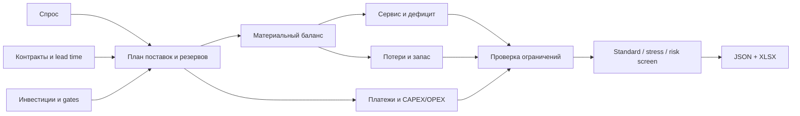
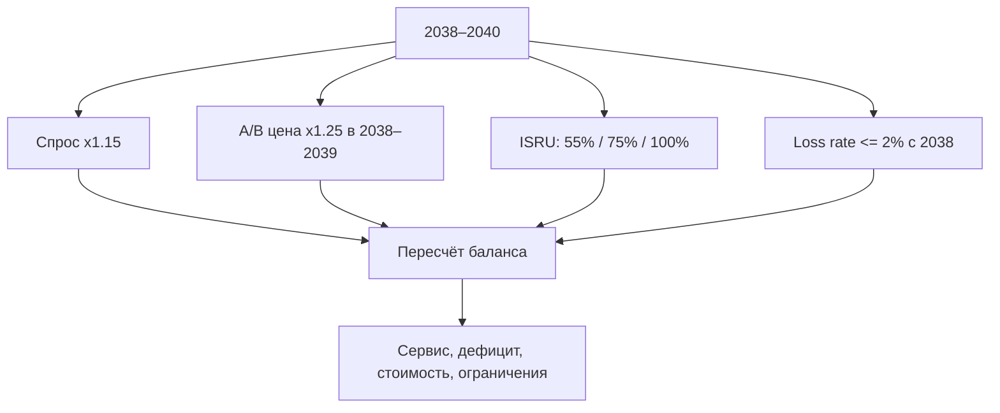

# Топливный космоконтур 2035

Стартовый репозиторий кейса «Топливный космоконтур 2035: криогенные компоненты для цислунарной транспортной системы».

Это не статический дашборд и не файл с заранее выбранной стратегией. В центре репозитория находится расчётное ядро: участник меняет поставки, резервирование, даты заказа, инвестиции и резерв, после чего интерфейс пересчитывает материальный баланс, стоимость, дефицит, ограничения и стресс-сценарий. Такой формат оставляет командам пространство для разных решений и одновременно даёт жюри единый проверяемый стержень.

## Быстрый старт

```bash
git clone https://github.com/SpaceEconomyPolicy/test_oil.git
cd test_oil
python -m pip install -r requirements.txt
streamlit run app.py
```

Контрольный прогон:

```bash
pytest -q
python scripts/smoke_control.py
```

На локальной проверке перед публикацией: **27 тестов пройдены**.

## Что можно менять в интерфейсе

- резерв мощности и плановую поставку по каждому каналу и году;
- месяц начала поставки и дату заказа;
- график CAPEX по CFM/ZBO-like upgrade, Lunar-ISRU и Earth-New;
- физический начальный запас и доказательство контрактного 45-дневного резерва;
- ставку дисконтирования и lead time Earth-New в заданном диапазоне;
- исходные строки источников для отдельного исследовательского сценария;
- сценарий: standard, mandatory stress, low demand, high demand;
- параметры отдельного Monte Carlo risk screen.

Приложение показывает годовой баланс, помесячную проверку ёмкости, стоимость по каналам, сервис критического и общего спроса, нарушения с годом и причиной, сравнение standard/stress, а также выгружает полный проект в JSON и расчёт в XLSX.

## Исходные данные кейса

Спрос, т/год:

| Год | Базовый общий | Базовый критический | Низкий общий | Высокий общий |
|---:|---:|---:|---:|---:|
|2035|100|80|80|110|
|2036|140|105|112|154|
|2037|190|135|152|209|
|2038|250|170|200|312.5|
|2039|320|210|256|400|
|2040|390|250|312|487.5|

Каналы: Earth-Core A, Earth-Flex B, Earth-New C, Lunar-ISRU D и Emergency E. Их учебные мощности, цены, take-or-pay, lead time и коэффициенты надёжности лежат в `data/sources.csv`. Эти числа относятся к кейсу и не выдаются за котировки конкретных ракет, поставщиков или реальных контрактов.

## Контрольная логика



Ключевые соглашения контрольного расчёта:

1. Критический спрос входит в общий и обслуживается первым.
2. Контрольный год содержит 365 дней. Для 45-дневного резерва используется `demand * 45 / 365`.
3. В standard своевременно заказанная доступная поставка приходит по плану. Надёжность не умножается на поставку автоматически.
4. В mandatory stress с 2038 года спрос увеличивается на 15%; цены A/B растут на 25% только в 2038–2039; фактическая поставка ISRU равна 55%/75%/100% плана в 2038/2039/2040 и повторно на reliability не умножается.
5. Потери 4.5% или 1.2% считаются один раз от валового поступления. Учебные 1.2% не трактуются как физическая характеристика реальной ZBO-системы.
6. Take-or-pay: оплачиваемое количество равно максимуму из планового отбора и минимального обязательства на активную часть периода.
7. Earth-New: 90 за опцион + 270 при реализации = 360, без повторного начисления ещё 360.
8. Emergency не может быть базовым каналом более двух последовательных лет.
9. 45-дневный резерв доказывается либо физическим запасом на начало года, либо достаточным резервом Emergency вместе с bridge coverage на время его активации.
10. В standard уровни 99% critical и 97% total являются жёсткими ограничениями; в stress они показываются как ориентиры устойчивости, а дефицит не скрывается.

## Обязательный стресс



## Почему нет готового «победного» плана

Кейс оценивает не угадывание одной комбинации, а качество модели, проверяемость, сравнение альтернатив, инвестиционную и контрактную логику, стресс-тесты, риски, интересы сторон и функциональность цифрового контура. Поэтому стартовые CSV намеренно пустые. Команда сама решает, что фиксировать заранее, что держать гибким, когда реализовать опцион и как обосновать Lunar-ISRU.

## Структура

```text
app.py                         интерактивный Streamlit-контур
src/fuel_contour/              расчётное ядро, сценарии, риск, экспорт
data/                          исходные таблицы и пустые шаблоны решения
configs/                       правила контрольного расчёта
notebooks/                     Jupyter-пример вызова ядра
tests/                         автоматические контрольные и граничные тесты
docs/                          методика, научная база, аудит источников, схемы
results/                       место для сохранённых результатов команды
.github/workflows/tests.yml    CI для Python 3.11–3.13
```

## Научная опора

Техническая часть опирается на литературу по cryogenic fluid management и in-space propellant transfer; логистическая часть — на space logistics, multi-sourcing, inventory resilience и robust/adaptive decision making. Полный список и связь «источник → положение → реализация → ограничение» находятся в `docs/scientific_basis.md`.

Особенно важны:

- Kenny R.J. et al. *Guidelines for In-Space Cryogenic Propellant Transfer*. AIAA ASCEND 2025. DOI: https://doi.org/10.2514/6.2025-4122
- Perrin T.M. *Guidelines for In-Space Cryogenic Propellant Transfer (ISCPT)*, Space Cryogenics Workshop presentation. NASA NTRS 20250003540: https://ntrs.nasa.gov/citations/20250003540
- Simonini A. et al. *Cryogenic propellant management in space: open challenges and perspectives*. npj Microgravity 10, 34 (2024). https://doi.org/10.1038/s41526-024-00377-5
- Sommariva A. et al. *Preliminary analyses on technical and economic viability of moon-mined propellant for on-orbit refueling*. Acta Astronautica 204 (2023). https://doi.org/10.1016/j.actaastro.2023.01.004
- Ho K. *Space Logistics Modeling and Optimization: Review of the State of the Art*. Journal of Spacecraft and Rockets 61(5), 2024. https://doi.org/10.2514/1.A35982
- Guo Y. et al. *Supply chain resilience: A review from the inventory management perspective*. Fundamental Research 5 (2025). https://doi.org/10.1016/j.fmre.2024.08.002
- Han B. et al. *The efficient and stable planning for interrupted supply chain with dual-sourcing strategy*. Omega 115 (2023). https://doi.org/10.1016/j.omega.2022.102775
- Bertsimas D., Sim M. *The Price of Robustness*. Operations Research 52(1), 2004. https://doi.org/10.1287/opre.1030.0065

## Проверка жюри

Рекомендуемый маршрут: запустить приложение → изменить одну поставку → увидеть нарушение → восстановить план → сравнить standard/stress → изменить инвестицию → проверить gate и CAPEX → сохранить JSON → выгрузить XLSX → повторно открыть JSON. Подробный чек-лист: `docs/jury_checklist.md`.

## Границы прототипа

Это decision-support prototype, а не система управления реальным топливным узлом. Он не проектирует бак, не считает термогидравлику LOX/LH2/LCH4, не определяет траектории, пусковой манифест и реальную цену запуска. Эти задачи требуют отдельных инженерных моделей и данных. Здесь проверяется управленческий контур снабжения на синтетических параметрах кейса.
