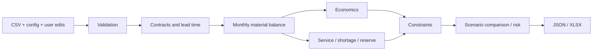

# Архитектура расчёта

```mermaid
flowchart LR
 I[CSV + config + user edits] --> V[Validation]
 V --> C[Contracts and lead time]
 C --> B[Monthly material balance]
 B --> E[Economics]
 B --> S[Service / shortage / reserve]
 E --> K[Constraints]
 S --> K
 K --> R[Scenario comparison / risk]
 R --> X[JSON / XLSX]
```
