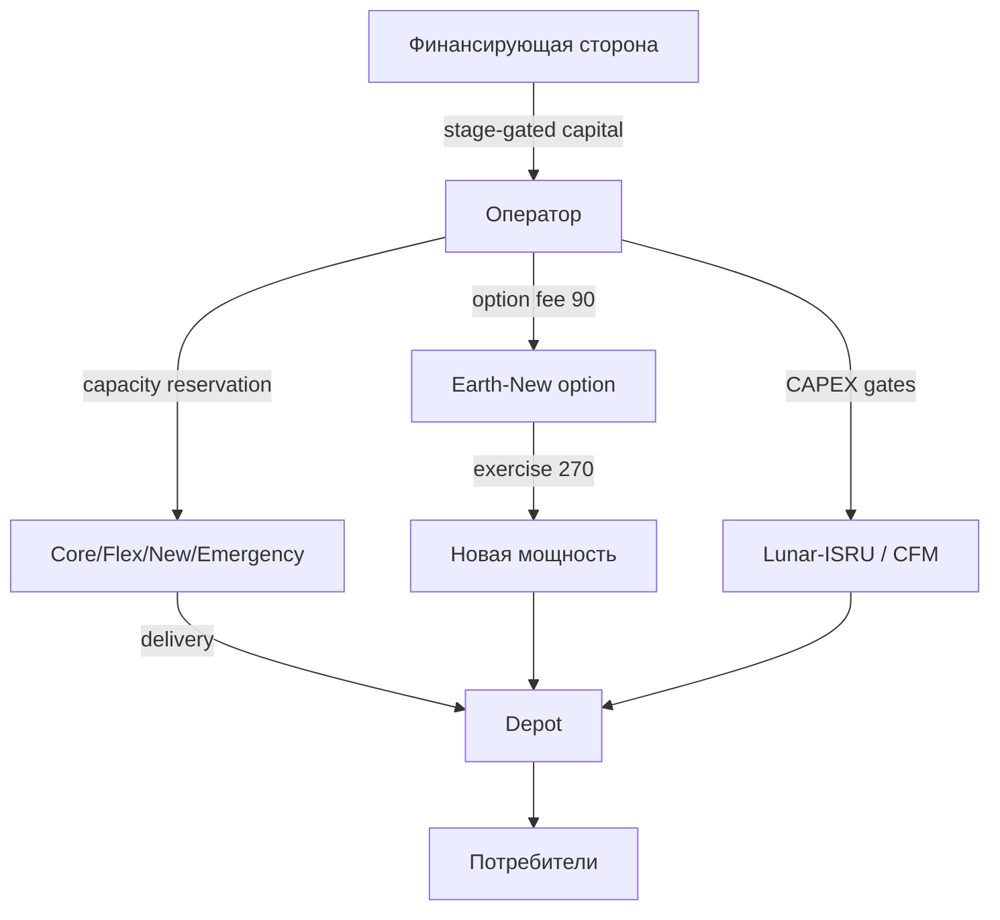

# Контрактно-финансовая архитектура

```mermaid
flowchart TD
 O[Оператор] -->|capacity reservation| A[Core/Flex/New/Emergency]
 O -->|option fee 90| C[Earth-New option]
 C -->|exercise 270| N[Новая мощность]
 O -->|CAPEX gates| D[Lunar-ISRU / CFM]
 A -->|delivery| H[Depot]
 N --> H
 D --> H
 H --> U[Потребители]
 F[Финансирующая сторона] -->|stage-gated capital| O
```
