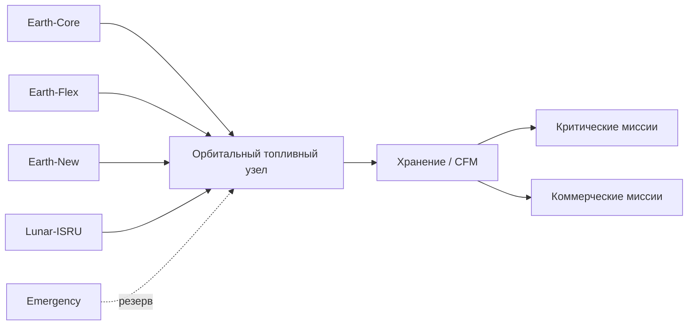

# Схема цепочки поставок

```mermaid
flowchart LR
 A[Earth-Core] --> H[Орбитальный топливный узел]
 B[Earth-Flex] --> H
 C[Earth-New] --> H
 D[Lunar-ISRU] --> H
 E[Emergency] -. резерв .-> H
 H --> S[Хранение / CFM]
 S --> K[Критические миссии]
 S --> M[Коммерческие миссии]
```
