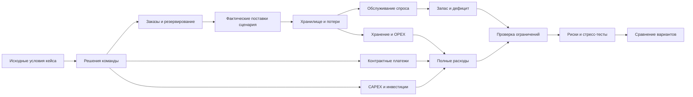

# Проектирование стартового репозитория кейса «Топливный космоконтур 2035»

Дата: 18 сентября 2026 г.

Статус: согласованный дизайн перед планированием реализации.

Репозиторий: `SpaceEconomyPolicy/test_oil`.

## 1. Назначение

`test_oil` должен стать стартовым техническим репозиторием организаторов кейса «Топливный космоконтур 2035: криогенные компоненты для цислунарной транспортной системы». Его задача — не дать участникам готовое решение, а зафиксировать общие правила задачи так, чтобы команды могли независимо построить собственные расчётные системы и получить сопоставимую основу для проверки.

Главный принцип репозитория:

> Репозиторий стандартизирует постановку, входные данные, семантику расчётов и процедуру проверки. Он не стандартизирует конкурсное решение.

Из этого следуют четыре ограничения дизайна.

1. В репозитории не должно быть готового оптимального плана снабжения.
2. В репозитории не должно быть готового приложения, которое можно выдать за конкурсный цифровой контур.
3. В репозитории не должно быть предписания, какие источники выбрать, когда покупать Lunar-ISRU, когда реализовывать Earth-New и каким должен быть размер закупки по каждому каналу.
4. Репозиторий должен быть достаточно подробным, чтобы разработчик мог самостоятельно реализовать корректное решение без устных уточнений организатора по базовой математике кейса.

## 2. Пользователи репозитория

Основной пользователь — участник технической команды. Предполагается, что он может хорошо программировать, но не обязан заранее знать экономику контрактов, управление запасами, особенности криогенной логистики или терминологию космической экономики.

Второй пользователь — экономист или системный аналитик команды. Для него README должен объяснить, где находятся управленческие решения, какие параметры фиксированы организатором и как проследить результат от решения до физического и финансового эффекта.

Третий пользователь — эксперт жюри. Для него структура репозитория должна облегчать проверку: быстро найти формулу, источник параметра, тест, ожидаемое поведение и границы применимости.

## 3. Что репозиторий обязан дать участнику

Стартовый набор должен давать шесть вещей.

### 3.1. Понятную постановку

Участник должен за несколько минут понять рабочий цикл:

`данные кейса -> решения команды -> расчёт -> проверка ограничений -> стресс -> сравнение -> выгрузка`.

### 3.2. Машиночитаемые исходные данные

Числа из постановки должны быть перенесены в структурированные файлы без скрытого изменения смысла. Для каждого поля фиксируются единица, статус и источник.

### 3.3. Формальные правила контрольного расчёта

Нужно описать минимальную математику, по которой жюри сможет проверить модель команды. Это включает материальный баланс, потери, обслуживание спроса, резерв, take-or-pay, резервирование мощности, CAPEX, OPEX и обязательный стресс.

### 3.4. Форматы обмена

Нужно дать языконезависимые схемы для плана, сценария, результата и экспорта. Это упрощает реализацию на Python, JavaScript, Java, C#, Go, R и других стеках.

### 3.5. Контрольные тесты

Команда должна иметь возможность проверить арифметику на синтетических данных, которые не раскрывают конкурсную стратегию.

### 3.6. Маршрут проверки

README должен буквально объяснить, как эксперт будет запускать, изменять и ломать решение на защите.

## 4. Что репозиторий не должен давать

В `test_oil` не включаются:

- рекомендуемая структура закупок по годам;
- готовые объёмы резервирования;
- оптимальная комбинация Earth-Core, Earth-Flex, Earth-New, Lunar-ISRU и Emergency;
- рекомендации о моменте инвестиций;
- готовые MCDA-веса;
- готовая функция полезности;
- готовый MILP или другой оптимизатор, решающий конкурсную задачу;
- готовый Streamlit/React/FastAPI-дашборд, который можно сдать вместо собственной разработки;
- прогнозы после 2040 года от имени организатора;
- вымышленные цены конкретных ракет, перевозчиков или компаний;
- искусственные вероятности геополитических событий.

Допускаются только синтетические демонстрационные данные, которые не совпадают с конкурсным набором и служат для проверки формул или структуры интерфейсов.

## 5. Архитектурная граница задачи

Контрольная модель кейса — агрегированная система снабжения одного условного орбитального топливного узла. Она не требует детального расчёта состава топлива, термодинамики баков, CFD, траекторий или конкретных ракет-носителей.

При этом модель должна различать:

- договорно доступную мощность;
- резервируемую мощность;
- заказанный объём;
- фактическую поставку;
- физический запас;
- обслуженный спрос;
- дефицит.

Эти величины не взаимозаменяемы.

## 6. Статусы параметров

Каждое поле стартового набора получает один из трёх статусов.

### `CASE_INPUT`

Исходное условие организатора. В контрольных сценариях оно не меняется командой скрытно.

Примеры: мощность канала, базовая цена, lead time, лимит CAPEX, спрос, заданная доля stress-delivery ISRU.

### `TEAM_DECISION`

Решение команды или пользователя цифрового контура.

Примеры: закупка, резервирование, выбранный момент реализации опциона, физический запас, контрактная конфигурация в пределах разрешённых правил.

### `TEAM_ASSUMPTION`

Дополнительное допущение, отсутствующее в исходнике. Оно допустимо только при явной маркировке и не должно выдаваться за официальный параметр кейса.

Примеры: ставка дисконтирования, если организатор её не задаёт; диапазон собственного риск-сценария; параметры исследовательского 2041 года.

## 7. Структура стартового репозитория

Целевая структура:

```text
.
├── README.md
├── data/
│   ├── demand.csv
│   ├── supply_sources.csv
│   ├── storage_options.csv
│   ├── investment_options.csv
│   ├── constraints.csv
│   └── README.md
├── scenarios/
│   ├── base.yaml
│   ├── mandatory_stress.yaml
│   └── README.md
├── schemas/
│   ├── demand.schema.json
│   ├── supply_sources.schema.json
│   ├── plan.schema.json
│   ├── scenario.schema.json
│   └── export.schema.json
├── examples/
│   ├── empty_plan.json
│   ├── invalid_plan_examples/
│   └── example_export_structure.csv
├── validation/
│   ├── README.md
│   ├── control_cases.md
│   └── expected_checks.json
├── docs/
│   ├── CASE_RULES.md
│   ├── DATA_DICTIONARY.md
│   ├── CALCULATION_RULES.md
│   ├── STRESS_PROTOCOL.md
│   ├── JURY_CHECKLIST.md
│   ├── SCIENTIFIC_BASIS.md
│   ├── SOURCES.md
│   ├── ERRATA_AND_PROVENANCE.md
│   ├── FAQ.md
│   ├── diagrams/
│   └── figures/
└── LICENSE
```

Структура не означает, что участник обязан повторять её. Это стартовая организация материалов организатора.

## 8. Содержание `README.md`

README — главный пользовательский документ и должен быть подробным. Он содержит следующие разделы.

1. Что это за репозиторий.
2. Что репозиторий не делает.
3. Задача в одном экране.
4. Что должна представить команда.
5. Что считается цифровым контуром.
6. Граница между условиями и решениями команды.
7. Исходные данные и происхождение чисел.
8. Единицы и временная логика.
9. Спрос.
10. Каналы снабжения.
11. Хранилище и потери.
12. Контракты: reservation и take-or-pay.
13. Инвестиции и опционы.
14. Материальный баланс.
15. Требования к обслуживанию спроса.
16. 45-дневный резерв.
17. BASE.
18. Обязательный STRESS.
19. Анализ чувствительности и дополнительные сценарии.
20. Риски и зависимости.
21. Стейкхолдеры и MCDA.
22. Требования к программной архитектуре.
23. Требования к интерфейсу.
24. Сохранение и экспорт.
25. Расширяемость.
26. Минимальные тесты.
27. Контрольные примеры.
28. Как жюри будет проверять.
29. Карта критериев.
30. Типовые ошибки.
31. Рекомендуемая структура репозитория команды.
32. Финальная проверка перед защитой.
33. Научная база.
34. Материалы постановщика.
35. Термины.

README должен быть достаточно подробным, чтобы участник мог реализовать систему без скрытых устных правил.

## 9. Первый экран README

Первый экран не содержит общего рассказа о развитии космонавтики. Он сразу формулирует задачу и границу репозитория.

Рекомендуемый смысл:

> Нужно разработать работающий цифровой инструмент для оператора условного орбитального топливного узла. Инструмент связывает закупки, резервирование, физический запас, контракты и инвестиции с материальным балансом, стоимостью, обслуживанием спроса, рисками и стресс-тестами.
>
> В репозитории нет готовой конкурсной стратегии. Организатор фиксирует данные и контрольные правила. Команда самостоятельно выбирает стратегию, метод анализа, программный стек и интерфейс.

## 10. Центральная схема README

README содержит логическую схему:



Схема задаёт смысловые блоки, но не программный стек.

## 11. Машиночитаемые данные

### 11.1. `data/demand.csv`

Поля:

- `year`;
- `base_total_t`;
- `base_critical_t`;
- `low_total_t`;
- `high_total_t`.

Критический спрос входит в общий и не должен суммироваться с ним повторно.

### 11.2. `data/supply_sources.csv`

Поля:

- `source_id`;
- `name`;
- `capacity_t_per_year`;
- `variable_cost_mln_per_t`;
- `reservation_rate_mln_per_t_year_capacity`;
- `take_or_pay_share`;
- `lead_time_min_months`;
- `lead_time_max_months`;
- `reliability`;
- `available_from_year`;
- `notes`.

Если исходный документ задаёт диапазон lead time, диапазон сохраняется. Он не сворачивается произвольно в одно число.

### 11.3. `data/storage_options.csv`

Поля:

- `storage_id`;
- `capacity_t`;
- `loss_rate_on_throughput`;
- `holding_cost_mln_per_t_year`;
- `capex_mln`;
- `fixed_opex_mln_per_year`;
- `available_from_year`.

Источник и хранилище разделены как разные сущности.

### 11.4. `data/investment_options.csv`

Поля должны позволять описать option fee, exercise cost, полный CAPEX, срок решения, срок ввода, дополнительный OPEX и эффект на мощность или хранилище.

### 11.5. `data/constraints.csv`

Минимальные поля:

- `constraint_id`;
- `metric`;
- `operator`;
- `value`;
- `period`;
- `scenario`;
- `severity`;
- `description`.

Ограничение должно быть машинно-читаемым и одновременно объяснимым человеку.

## 12. Сценарии как данные

### 12.1. BASE

BASE хранится отдельно и не содержит решений команды.

### 12.2. MANDATORY_STRESS

Обязательный stress описывается данными:

- базовый общий и критический спрос: +15% в 2038–2040;
- variable cost Earth-Core: +25% в 2038–2039;
- variable cost Earth-Flex: +25% в 2038–2039;
- в 2040 цены Earth-Core и Earth-Flex возвращаются к контрольным значениям;
- actual delivery Lunar-ISRU: 55% плана в 2038, 75% в 2039, плановый объём в 2040;
- ограничение `losses / throughput <= 2%` с 2038 года.

Доля фактической поставки Lunar-ISRU в этом stress не умножается повторно на reliability.

## 13. Формат плана

`schemas/plan.schema.json` описывает переносимый формат решений команды.

Минимальная логика:

```json
{
  "plan_id": "string",
  "scenario_id": "BASE",
  "decisions": {
    "supply_orders": [],
    "capacity_reservations": [],
    "investments": [],
    "inventory_policy": {}
  }
}
```

Стартовый `examples/empty_plan.json` не содержит заполненной конкурсной стратегии.

## 14. Материальный баланс

Контрольное правило:

`I_end = I_start + Q_delivered - Losses - Q_served`.

Где:

- `I_start` — физический запас на начало периода;
- `Q_delivered` — фактически поступивший объём;
- `Losses` — потери текущего периода;
- `Q_served` — объём, выданный потребителям;
- `I_end` — физический остаток.

Отрицательный физический запас запрещён как интерпретация. Дефицит хранится отдельно:

`Shortage = max(0, Demand - Q_served)`.

Команда сама выбирает временной шаг, но он должен выявлять внутригодовой дефицит и переполнение хранилища и учитывать lead time.

## 15. Потери и хранение

Для контрольного расчёта:

`Throughput = валовое поступление топлива за период`.

`Losses = Throughput * loss_rate`.

Коэффициент нельзя повторно применять к тому же топливу через остаток, если это приводит к двойному учёту одной и той же модельной потери.

Учебные коэффициенты 4,5% и 1,2% — параметры кейса. README должен явно сказать, что они не являются универсальными характеристиками реальной технологии ZBO.

Стоимость хранения считается по среднему физическому запасу с учётом времени согласно контрольной методике постановки.

## 16. 45-дневный резерв

Контрольная формула:

`R_y = D_y * 45 / 365`.

Резерв считается от общего спроса соответствующего сценария и года.

Физический запас и договорный аварийный резерв не считаются одной и той же сущностью. Если команда использует Emergency для эквивалентного покрытия, она должна показать объём, срок активации и покрытие периода до прибытия поставки.

## 17. Контрактная математика

Контрольное правило take-or-pay:

`Q_pay = max(Q_order, take_or_pay_share * Q_reserved_period)`.

`VariablePayment = price * Q_pay`.

Плата за резервирование считается отдельно по установленной ставке и длительности периода.

Take-or-pay не начисляется второй раз поверх уже учтённого минимального оплачиваемого объёма.

## 18. Инвестиции

Для Earth-New контрольная трактовка стоимости опциона:

`90 + 270 = 360 млн у.е.`.

Нельзя дополнительно прибавлять ещё один полный CAPEX 360 поверх этих двух платежей.

README показывает только правило учёта, но не советует, покупать ли опцион и когда его реализовывать.

Для Lunar-ISRU и ZBO аналогично фиксируются входные параметры и временные зависимости, но инвестиционное решение остаётся у команды.

## 19. Финансовая модель

Минимальные компоненты полной стоимости:

- закупочные платежи;
- плата за резервирование;
- хранение;
- фиксированный OPEX;
- CAPEX.

Базовое разложение:

`TotalCost = Procurement + Reservation + Holding + FixedOPEX + CAPEX`.

Если команда использует NPV, ставка и момент дисконтирования раскрываются. Если ставка не дана организатором, это `TEAM_ASSUMPTION`. При сравнении альтернатив одной команды ставка не должна скрытно меняться.

## 20. Обслуживание спроса

Контрольные показатели:

`SL_total = served_total / demand_total`.

`SL_critical = served_critical / demand_critical`.

В BASE минимальные требования:

- общий спрос: 97%;
- критический спрос: 99%.

Критический спрос входит в общий.

В обязательном stress эти уровни показываются как ориентиры устойчивости. Если модель не достигает их, она должна показать дефицит и причину, а не менять исходные ограничения задним числом.

## 21. Надёжность

В BASE коэффициент reliability не используется автоматически как множитель поставки.

Неверная контрольная конструкция:

`delivered = ordered * reliability`.

Reliability используется в отдельном блоке риска, если команда объяснила его математический смысл.

В обязательном stress нельзя считать:

`ISRU_plan * 0.55 * reliability` для 2038 года,

если 55% уже определены как фактическая доля поставки в этом stress.

## 22. Стресс-тесты и неопределённость

README различает:

- обязательный stress;
- sensitivity analysis;
- дополнительный риск-сценарий команды;
- reverse stress test;
- robust analysis;
- Monte Carlo.

Не все дополнительные методы обязательны.

Если используется Monte Carlo, команда должна раскрыть происхождение распределений, зависимости, число испытаний, seed и точность. Произвольный набор сценариев нельзя выдавать за статистически подтверждённую вероятность.

## 23. Риск-регистр

Для каждого существенного риска рекомендуются поля:

- `risk_id`;
- событие;
- причина;
- затронутый параметр;
- период;
- основание вероятности, диапазон или статус сценарного допущения;
- физическое последствие;
- денежное последствие;
- последствие для service level;
- зависимые риски;
- владелец;
- мера;
- остаточный риск.

Порядковая шкала допустима как средство приоритизации, но произведение баллов типа `3 * 4` не выдаётся за денежный ущерб.

## 24. Стейкхолдеры и MCDA

Минимальные стороны:

- оператор узла;
- критические потребители;
- коммерческие потребители;
- поставщики топлива и доставки;
- финансирующая сторона.

Если команда использует MCDA, она сама выбирает критерии и веса, но должна раскрыть нормализацию, происхождение весов и чувствительность вывода к профилю приоритетов.

Стартовый репозиторий не задаёт готовые веса.

## 25. Требования к цифровому контуру

Функциональная цепочка:

`inputs -> decisions -> calculation -> validation -> scenario comparison -> save -> export`.

Инструмент должен позволять без правки кода:

- менять разрешённые решения;
- пересчитывать результат;
- видеть нарушения с годом и фактической величиной;
- переключать BASE/STRESS;
- сравнивать варианты;
- сохранять и повторно открывать план;
- выгружать результаты.

Стек свободный.

## 26. Языконезависимый software contract

README рекомендует, но не навязывает такое разделение ответственности:

```text
load_case()
validate_case()
load_plan()
validate_plan()
apply_scenario()
calculate_deliveries()
calculate_inventory()
calculate_service()
calculate_costs()
check_constraints()
evaluate_risks()
compare_scenarios()
save_plan()
load_saved_plan()
export_results()
```

Это контракт архитектуры, а не готовая реализация.

## 27. Формат ошибок

Нарушения должны быть объяснимыми.

Пример формата:

```text
CAPACITY_EXCEEDED
source=Earth-Flex
year=2038
reserved=130
maximum=110
```

Интерфейс не должен ограничиваться общей ошибкой без причины.

## 28. Контрольные тесты

`validation/control_cases.md` содержит только синтетические тесты.

Минимальный набор:

1. материальный баланс;
2. нулевой спрос;
3. нулевая поставка;
4. переполнение хранилища;
5. превышение мощности;
6. take-or-pay;
7. резервирование на часть года;
8. CAPEX timing;
9. Emergency lead time;
10. обязательный STRESS;
11. экспорт;
12. повторная загрузка сохранённого плана.

### Пример синтетического теста материального баланса

Вход:

- opening inventory = 10;
- delivery = 30;
- losses = 2;
- served = 25.

Ожидаемый closing inventory = 13.

### Пример синтетического take-or-pay

- reserved = 100;
- take-or-pay = 70%;
- order = 50;
- price = 2.

Минимально оплачиваемый объём = 70, variable payment = 140.

Эти числа не связаны с конкурсным планом.

## 29. Расширяемость

На копии набора команда должна показать добавление нового источника и будущего периода без переписывания расчётной логики для каждой строки.

README предлагает тест с искусственным `Source-X`, не связанным с реальным конкурсным источником.

Для 2041 года команда сама задаёт исследовательские спрос, цены, доступность и ограничения. Эти значения не называются прогнозом организатора.

## 30. Экспорт

Минимальные машиночитаемые результаты:

- `yearly_balance`;
- `source_schedule`;
- `inventory_trace`;
- `financial_breakdown`;
- `constraint_checks`;
- `scenario_comparison`;
- `risk_register`.

Выгрузка содержит scenario id, периоды, единицы и ссылку на допущения или сами допущения.

Числа в экспорте должны совпадать с интерфейсом.

## 31. Маршрут проверки жюри

README содержит отдельный чек-лист:

1. установить и запустить проект;
2. открыть BASE;
3. выбрать один год и один канал;
4. проследить вход -> формула -> результат -> ограничение;
5. изменить разрешённое решение без правки кода;
6. получить пересчёт;
7. создать заведомо неисполнимый план;
8. увидеть конкретное нарушение;
9. запустить обязательный STRESS;
10. сравнить BASE и STRESS;
11. выгрузить результат;
12. повторно открыть сохранённый план;
13. на копии данных добавить источник или период.

## 32. Карта критериев

README связывает функции с официальной шкалой:

| Блок | Баллы |
|---|---:|
| Корректность и надёжность расчётной модели | 25 |
| Архитектура расчёта и обоснование стратегии | 20 |
| Методики и результаты стресс-тестирования | 20 |
| Реестр рисков | 15 |
| Стейкхолдеры и адаптация | 10 |
| Работоспособность цифрового контура | 10 |
| Геополитический модуль | до +5 |

README не предлагает способ «набрать баллы» через косметику. Он показывает, какой проверяемый артефакт соответствует каждому критерию.

## 33. Геополитический бонусный модуль

Стартовый репозиторий не прогнозирует политические события.

Он может описать интерфейс исследовательского сценария:

- название события;
- затронутые каналы;
- затронутая составляющая цены или агрегированная цена;
- период;
- коэффициент или диапазон;
- источник или статус `TEAM_ASSUMPTION`.

Модуль должен работать на копии набора и позволять восстановить контрольные значения.

## 34. Научная база

Научная часть строится по правилу:

`источник -> положение/метод -> использование в кейсе -> ограничение применимости`.

### Основные источники для методической рамки

#### NASA-STD-7009B

Использование: credibility assessment, verification, validation, sensitivity, uncertainty и документирование границ модели.

Не используется для подтверждения синтетических цен или мощностей кейса.

#### Koki Ho, Space Logistics Modeling and Optimization: Review of the State of the Art, Journal of Spacecraft and Rockets, 2024, DOI 10.2514/1.A35982

Использование: связь космической логистики с network-flow planning, inventory control, инфраструктурой и неопределённостью.

Не используется как источник конкретных экономических параметров кейса.

#### Alessia Simonini et al., Cryogenic propellant management in space: open challenges and perspectives, npj Microgravity, 2024, DOI 10.1038/s41526-024-00377-5

Использование: научное основание необходимости долгосрочного управления криогенными компонентами, хранения и transfer.

Не используется для превращения модельного коэффициента 1,2% в заявленную характеристику реальной ZBO-технологии.

#### Andrea Sommariva et al., Preliminary analyses on technical and economic viability of moon-mined propellant for on-orbit refueling, Acta Astronautica 204, 2023, DOI 10.1016/j.actaastro.2023.01.004

Использование: пример совместного техническо-экономического анализа земного и лунного снабжения орбитального депо и работы с высокой неопределённостью.

Не используется для объявления Lunar-ISRU победителем в синтетическом кейсе.

#### Dimitris Bertsimas, Melvyn Sim, The Price of Robustness, Operations Research 52(1), 2004, DOI 10.1287/opre.1030.0065

Использование: методическое основание robust analysis.

Не делает robust optimization обязательной для команды.

#### Kenny R. J., Eddleman D. E., Keplinger J. D., Stephens J. R., Hartwig J. W., Perrin T. M., Guidelines for In-Space Cryogenic Propellant Transfer, 2025

Использование: инженерная рамка in-space cryogenic propellant transfer.

В `SOURCES.md` нужно отдельно развести NASA NTRS-материалы и AIAA ASCEND publication, чтобы презентация, guidelines document и конференционная публикация не смешивались как один источник.

## 35. Происхождение данных и ERRATA

Поскольку постановка ссылается на `Анкета_постановщика_КосмоХакатон_ЕТ.xlsx`, а в предоставленном наборе этот XLSX отсутствует, репозиторий должен включать `docs/ERRATA_AND_PROVENANCE.md`.

Для каждого числового параметра фиксируется:

- файл-источник;
- раздел или страница;
- перенесённое значение;
- единица;
- статус;
- наличие возможной неоднозначности.

Если позже будет предоставлен исходный XLSX, его нужно сверить с машинно-читаемыми данными до объявления репозитория финальным.

Никакие пропуски исходника не заполняются догадками.

## 36. Схемы README

README должен включать минимум семь содержательных Mermaid-схем.

1. Рабочий цикл кейса.
2. Общая цепочка поставок.
3. Различие reserved -> ordered -> delivered -> served.
4. Материальный баланс.
5. Инвестиционная временная шкала decision -> lead time -> commissioning -> operation.
6. BASE/STRESS и изменяемые параметры.
7. Маршрут проверки жюри.

## 37. Графики и изображения

Стартовый репозиторий не публикует график «оптимальной стратегии» на реальных данных кейса.

Допускаются иллюстративные графики на явно синтетических данных:

- supply by source;
- demand vs served;
- inventory trace;
- expenditure breakdown;
- CAPEX timeline;
- service level;
- constraint violations;
- sensitivity chart;
- scenario comparison.

Каждый такой рисунок подписывается как иллюстрация интерфейса на синтетических данных.

## 38. Стиль документации

Русский текст должен быть технически точным, но не канцелярским. Избегаются:

- пустые вводные абзацы;
- ссылки на неназванных «экспертов»;
- чрезмерные номинализации;
- одинаковый ритм предложений;
- бессодержательные выводы;
- декоративные списки без необходимости;
- чрезмерная типографическая симметрия.

Редакторские рекомендации `humanizer-ru` используются как чек-лист качества языка, а не как гарантия прохождения какого-либо AI-detector и не как повод намеренно портить текст ошибками.

## 39. Критерии готовности стартового репозитория

Репозиторий можно считать готовым только если выполняются все условия ниже.

### Документация

- README объясняет задачу от входов до защиты.
- Нет скрытого готового конкурсного решения.
- Все ключевые формулы определены однозначно.
- Все исходные числа имеют происхождение.
- Научные источники связаны с конкретными методами и ограничениями применимости.

### Данные

- Данные машиночитаемы.
- Единицы согласованы.
- `CASE_INPUT`, `TEAM_DECISION`, `TEAM_ASSUMPTION` различимы.
- BASE и STRESS разделены.

### Валидация

- Синтетические контрольные примеры имеют ожидаемые результаты.
- Проверены double counting, отрицательный inventory, capacity overflow и contract payment logic.
- Контрольные примеры не раскрывают стратегию конкурса.

### Вариативность

- Репозиторий не вынуждает команды использовать один интерфейс.
- Не вынуждает использовать один алгоритм.
- Не вынуждает использовать ISRU.
- Не содержит единственного «правильного» плана.

### Проверяемость

- Эксперт может понять, какие функции обязан показать участник.
- Каждому критерию оценки соответствует проверяемый артефакт или действие.

## 40. Граница первой реализации `test_oil`

Первая версия репозитория должна содержать:

- большой `README.md`;
- нормализованные `data/`;
- BASE и mandatory stress;
- JSON Schemas;
- пустые и невалидные примеры;
- синтетические контрольные тест-векторы;
- документацию по правилам, данным, научной базе, жюри и provenance;
- Mermaid-схемы внутри Markdown;
- при необходимости отдельные статические схемы/рисунки только на синтетических данных.

Первая версия не должна содержать готового продукта команды.

## 41. Итоговый принцип

Если две команды строят разные цифровые контуры, используют разные методы выбора и приходят к разным стратегиям, это допустимо. Их решения должны отличаться по содержанию, но проверяться на одной исходной базе и по одинаковым контрольным правилам.

Стартовый репозиторий нужен именно для этого: уменьшить неоднозначность постановки, не уничтожив пространство для инженерного и экономического выбора участников.
